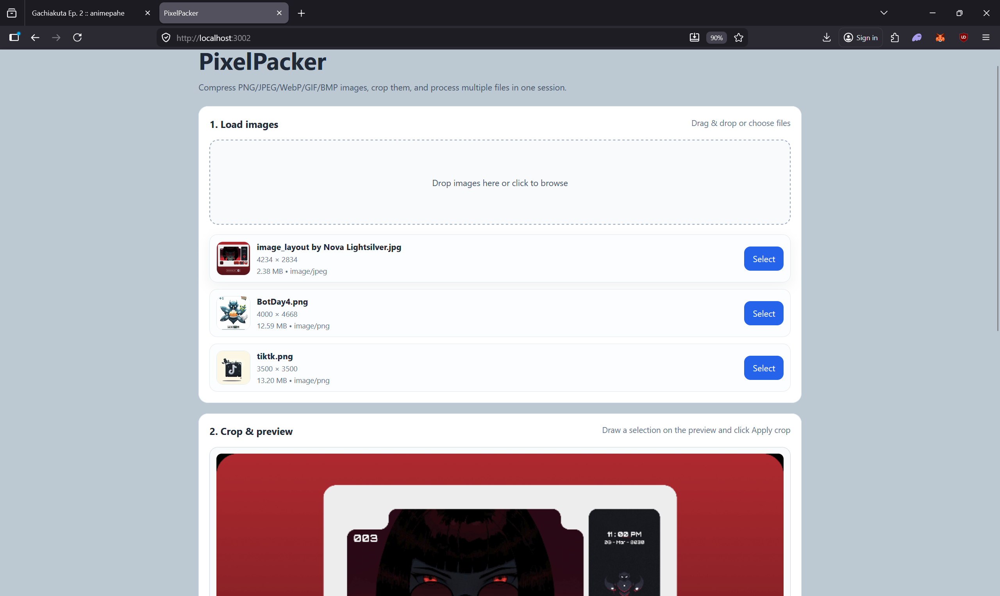

# Local Image Compressor

A minimal local web app for compressing and cropping images directly in the browser.



## Overview

This project provides a browser-based image compressor that runs locally from a simple Node.js static server. It is designed to:

- support common image formats including PNG, JPEG, WebP, GIF, and BMP
- allow single-image cropping via a preview canvas
- compress multiple images in bulk
- download compressed files individually or save the batch to a local folder

The app is intentionally lightweight and works without any backend image processing service.

## Features

- `Drag & drop` image loading
- `Bulk file selection` for compressing multiple images in one session
- `Preview canvas` for selecting a crop area
- `Output format` selection: keep original, JPEG, PNG, or WebP
- `Quality slider` for lossy image export
- `Download` each compressed file separately
- `Save all to folder` when the browser supports the File System Access API

## Tech stack

- `HTML` + `CSS` + `Vanilla JavaScript`
- `Node.js` for a local static file server
- `Canvas API` for image preview, crop, and compression

## Installation

1. Ensure Node.js is installed.
2. Open a terminal in the project folder:

```bash
cd C:\Users\N\Documents\DEV_CODE\Image_compressor
```

3. Start the app:

```bash
node server.js
```

4. Open the URL shown in the terminal, for example:

```bash
http://localhost:3000
```

If port `3000` is already in use, the server will automatically try the next available port up to `3003`.

## How to use

1. Open the app in your browser.
2. Drag and drop images onto the load area or click to browse files.
3. Click a file card to make it active for preview and cropping.
4. Use the preview canvas to draw a crop rectangle:
   - click and drag on the image
   - release to lock the selection
5. Click `Apply crop` to crop the active image.
6. Choose an output format and adjust the quality slider.
7. Click `Compress all selected` to compress every loaded image.
8. Download compressed images using the buttons in the results section.
9. If your browser supports it, click `Save all to folder` to write all compressed files to disk.

## Browser support

- Works best in Chromium-based browsers (Chrome, Edge, Brave) for full file save support.
- The `Save all to folder` feature depends on `window.showDirectoryPicker()`.
- If the folder picker is unavailable, you can still download each result manually.

## File format support

- PNG
- JPEG / JPG
- WebP
- GIF
- BMP

## Notes

- Compression is performed client-side, so the quality/size tradeoff depends on the browser's `canvas.toBlob()` implementation.
- Cropping and compression happen in-memory; no image files are uploaded anywhere.
- The app does not currently preserve EXIF metadata.

## Troubleshooting

- If the server fails to start because the port is in use, rerun with a different port:

```bash
set PORT=3004 && node server.js
```

- If images do not load, verify they are one of the supported formats.
- If the crop selection does not appear, make sure a file card is active and that you click-and-drag inside the preview canvas.

## Next steps

Possible future improvements:

- add drag-and-drop folder support
- preserve or remove EXIF metadata explicitly
- implement a batch rename/output naming scheme
- add a progress indicator for large batches
- support direct target-size compression
